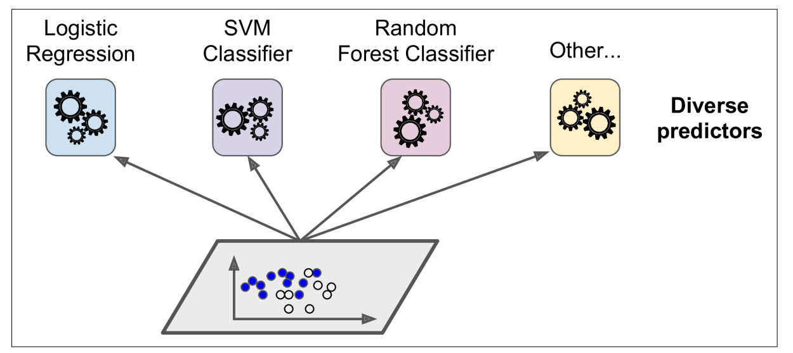
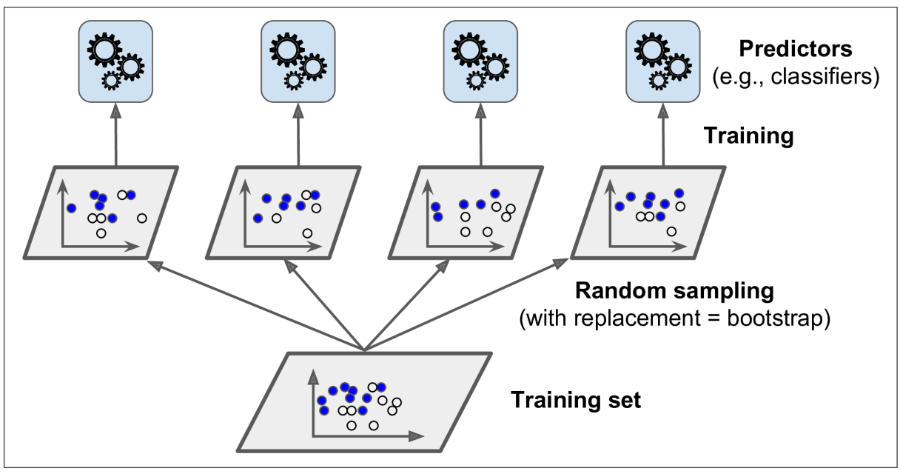
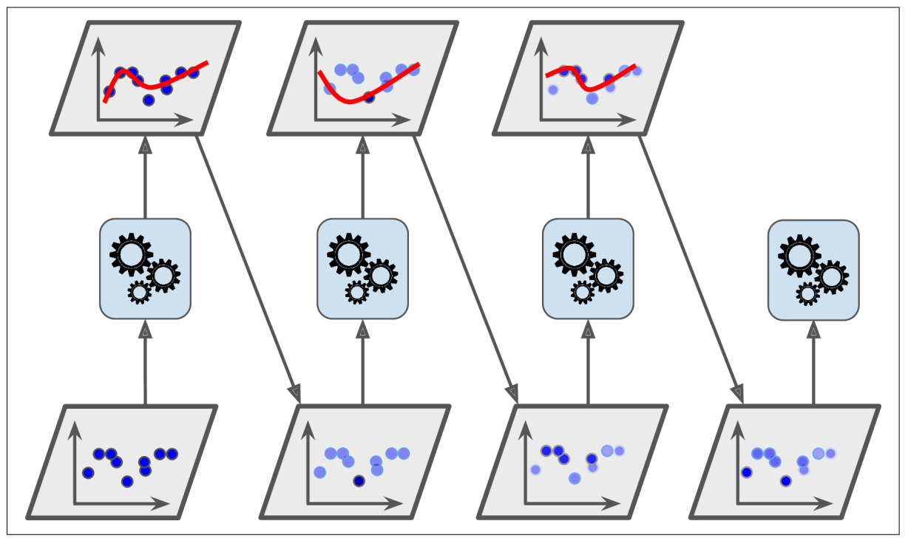
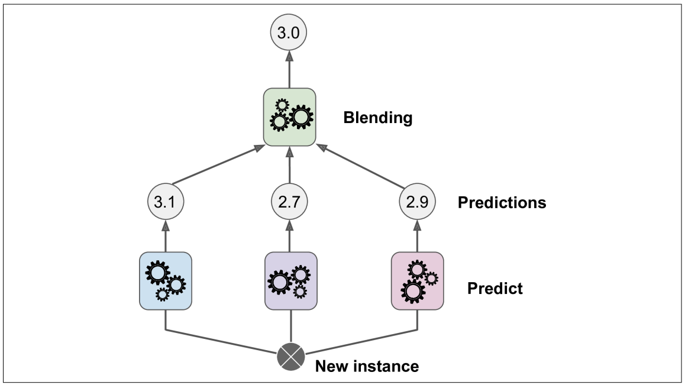

# Model Ensemble
> 작성자: [이다인](https://github.com/daainn)   
> 키워드: Voting, Bagging, Boosting, Stacking

## 모델 앙상블이란?
- 앙상블 학습(Ensemble Learning)은 여러 모델을 결합해 단일 모델보다 더 뛰어난 예측 성능과 일반화 능력을 확보하는 기법이다. 서로 다른 오차 특성을 가진 모델들을 조합함으로써 과적합을 줄이고 안정성을 높인다. 대표적인 방식으로는 Voting, Bagging, Boosting, Stacking 등이 있다.
- **필요성:** 단일 모델은 데이터의 특정 패턴에 과적합되거나 편향된 예측을 할 수 있기 때문에, 다양한 모델의 예측을 종합함으로써 더 일관되고 견고한 예측 결과를 도출할 수 있다. 특히 복잡한 문제나 노이즈가 많은 데이터에서 성능 향상과 예측 신뢰도를 확보하기 위해 앙상블 기법이 효과적이다.

## 앙상블 기법 종류

대표적인 앙상블 기법으로는 Voting, Bagging, Boosting, Stacking이 있으며, 각각의 방식은 모델 결합 방식과 학습 전략에 따라 구분된다.

|  |  |
| :-------------------------------: | :--------------------------------: |
| **1. Voting (투표 기반 앙상블)**     | **2. Bagging (Bootstrap Aggregating)** |

|  |  |
| :---------------------------------: | :---------------------------------: |
| **3. Boosting 구조**                  | **4. Stacking 구조 (Blending 포함)** |

> 출처: Géron, A. (2019). Hands-On Machine Learning with Scikit-Learn, Keras, and TensorFlow, 2nd Edition. O'Reilly Media.

**1. Voting**  
여러 모델의 예측 결과를 다수결(Hard) 또는 확률 평균(Soft) 방식으로 결합한다.  
학습은 독립적으로 진행되며, 성능이 고른 모델 조합에 효과적이다.

**2. Bagging**  
복원 추출된 샘플로 여러 모델을 병렬 학습시켜 결과를 평균 또는 다수결로 결합한다.  
분산이 큰 모델(예: 결정 트리)의 과적합을 줄이는 데 효과적이며, 대표적으로 Random Forest가 있다.

**3. Boosting**  
약한 학습기를 순차적으로 학습시키며, 이전 모델의 오류를 보완하는 방식이다.  
성능은 높지만 과적합과 학습 시간이 길 수 있으며, 대표적으로 AdaBoost, XGBoost 등이 있다.

**4. Stacking**  
여러 모델의 예측 결과를 다시 학습 데이터로 사용해 메타모델이 최종 예측을 수행한다.  
구현이 복잡하지만 서로 다른 모델 간 시너지를 낼 수 있어 높은 성능을 기대할 수 있다.

## 앙상블 기법 간 비교

| 방법 | 장점 | 단점 |
| ----- | ----- | ----- |
| Voting | 서로 다른 알고리즘을 조합하여 모델 간 상호 보완 가능, 간단한 구현으로 빠른 실험 가능 | 개별 모델 간 성능 차이가 클 경우, 저성능 모델이 전체 성능을 떨어뜨릴 수 있음 |
| Bagging | 고분산 모델의 분산을 낮춰 과적합 방지, 병렬 학습 가능하여 효율적 | 고편향 모델에 대해서는 효과가 제한적, 각 모델이 동일한 가중치를 가짐 |
| Boosting | 순차적 학습으로 오차를 집중적으로 보완, 복잡한 패턴까지 포착 가능 | 이상치에 민감하고 과적합 위험이 있으며, 학습 시간과 튜닝 복잡도가 큼 |
| Stacking | 여러 모델의 장점을 종합해 높은 예측 성능 가능, 메타 모델을 통한 추가 학습으로 일반화 성능 향상 | 적절한 메타 모델 선정과 데이터 분리 전략이 필요하며, 구조가 복잡하고 구현 난이도가 높음 |

## 앙상블 기법을 활용한 알고리즘 종류
- **Voting**  
  `VotingClassifier`: 여러 분류기의 예측 결과를 결합하여 최종 예측을 도출하는 앙상블 모델이다.

- **Bagging**  
  `RandomForestClassifier`: 여러 결정 트리를 랜덤하게 학습시켜 예측을 평균하는 모델이다.  
  `ExtraTreesClassifier`: 트리의 분할 기준까지 무작위로 선택해 분산 감소 효과를 높인 모델이다.

- **Boosting**  
  `AdaBoostClassifier`: 잘못 예측한 샘플에 가중치를 두고 약한 분류기를 반복 학습한다.  
  `GradientBoostingClassifier`: 잔차 오차를 줄이는 방향으로 모델을 순차적으로 학습한다.  
  `XGBoost`: 정규화와 조기 종료 기능이 포함된 고성능 그래디언트 부스팅 모델이다.  
  `LightGBM`: 히스토그램 기반 학습과 리프 중심 트리 분할로 속도와 성능을 개선한 모델이다.  
  `CatBoost`: 범주형 변수 처리에 최적화되어 있고, 학습 안정성과 일반화 성능이 뛰어난 모델이다.

- **Stacking**  
  `StackingClassifier`: 여러 모델의 예측 결과를 입력으로 받아 메타 모델이 최종 예측을 수행하는 앙상블 모델이다.

  

## 💬 **Follow-up Questions**

<strong>단일 모델보다 앙상블이 유리한 상황</strong>

 

1. **고분산 모델에 적용할 때**
   결정 트리처럼 과적합되기 쉬운 모델에 Bagging을 사용하면 분산을 줄일 수 있다.

2. **복잡하거나 노이즈가 많은 데이터일 때**  
   여러 모델의 평균화 효과로 노이즈 영향을 완화하고 안정적인 예측이 가능하다.

3. **예측 성능을 극대화해야 할 때**  
   1~2%의 향상이 중요한 서비스나 대회 환경에서 유리하다.

4. **모델 간 오류 특성이 상호 보완적일 때**  
   다양한 모델을 조합해 서로의 약점을 보완하고 정확도를 높일 수 있다.

<strong>Boosting에서 과적합 위험이 존재하는 이유 및 학습 시간이 오래 걸리는 이유</strong>
Boosting은 약한 학습기를 순차적으로 학습시키며 이전 오류를 보완해가는 방식이다.  
이 과정에서 오차가 큰 샘플에 집중하기 때문에 노이즈까지 학습하여 과적합될 수 있다.

또한 각 단계가 이전 결과에 의존하기 때문에 병렬처리가 어렵고 학습 시간이 오래 걸린다.  
가중치 조정과 오류 계산이 반복되고, 하이퍼파라미터가 많아 튜닝 부담도 크다.

<strong>VotingClassifier에서 서로 다른 알고리즘을 사용하는 경우 발생할 수 있는 문제는?</strong>
서로 다른 알고리즘은 확률 스케일이나 예측 방식이 달라 Soft Voting에서 평균값이 왜곡될 수 있다.  
예: 어떤 모델은 확신이 높고, 다른 모델은 보수적으로 확률을 출력해 전체 예측에 영향을 줌.

또한 각 모델의 **학습 시간, 입력 처리 방식, 튜닝 난이도**가 달라 파이프라인 구성이 복잡해진다.  
과적합 위험이 상이한 모델이 섞이면 전체 예측의 **안정성과 해석력**이 떨어질 수 있다.

<strong>Bagging과 Boosting은 모두 샘플링 기반 기법인데, 학습 방식에 어떤 차이가 있는지</strong>

**Bagging**은 데이터를 복원 추출해 여러 서브셋을 만들고, 각 모델을 병렬로 학습시켜 분산을 줄인다.  
모델은 서로 다른 데이터를 학습하므로 과적합을 완화하는 데 효과적이다.

**Boosting**은 순차적으로 모델을 학습시키며, 이전 모델의 오류에 가중치를 두어 보완한다.  
성능은 점진적으로 향상되지만, 오류에 과도하게 집중할 경우 과적합될 수 있다.

<strong>Stacking에서 사용되는 메타 모델은 어떤 기준으로 선택하는지</strong>

메타 모델은 기저 모델의 예측값을 입력으로 받아 최종 출력을 생성하는 역할을 한다.  
과적합 방지를 위해 일반적으로 **로지스틱 회귀, 릿지 회귀** 같은 단순 모델을 사용한다.

선택 기준은 다음과 같다:
- 기저 모델의 예측 분포에 적절한 구조인지
- 복잡한 조합을 과도하게 따르지 않고 일반화 성능이 뛰어난지
- 교차검증 기반으로 성능 평가가 가능한지

또한 **k-fold cross validation**을 사용해 기저 모델의 예측값을 생성함으로써 과적합을 방지한다.

<strong>RandomForest와 ExtraTrees는 같은 Bagging 계열인데, 어떻게 다르고 어떤 상황에서 선택하는지</strong>

두 모델 모두 Bagging 기반으로 여러 결정 트리를 학습하지만, **트리 분할 방식**에 차이가 있다.

- **RandomForest**는 일부 feature 후보 중 최적의 분할을 선택하며, 높은 정확도를 보이지만 학습 시간이 길다.
- **ExtraTrees**는 분할 기준까지 무작위로 선택해 학습 속도가 빠르고 분산이 낮지만, 성능은 약간 떨어질 수 있다.

👉 정확도가 중요할 경우 RandomForest를, 속도가 중요하고 약간의 성능 손실을 감수할 수 있다면 ExtraTrees를 사용한다.

<strong>LightGBM이 Gradient Boosting보다 빠른 이유</strong>

LightGBM은 **Histogram-based learning**과 **Leaf-wise 트리 성장 방식**을 채택하여 속도와 효율을 극대화한다.

- **Histogram 방식**: 연속형 피처를 구간별로 이산화하여 연산 속도를 높이고 메모리 사용량을 줄인다.
- **Leaf-wise 성장**: loss 감소가 가장 큰 leaf를 우선 분할하여 depth-wise보다 빠르고 정확한 모델을 만든다.

이 두 방식 덕분에 LightGBM은 동일 조건에서 더 빠른 학습과 더 적은 리소스를 요구한다.

<strong>비슷한 트리 기반 모델인 RandomForest, XGBoost, LightGBM을 실제 프로젝트에 쓸 때는 어떤 기준으로 선택해야 하는지</strong>

- **RandomForest**  
  Bagging 방식으로 트리를 독립적으로 학습해 과적합이 덜하고 학습 속도가 빠르다.  
  초기 탐색 단계나 기본 성능 확인용으로 적합하다.

- **XGBoost**  
  Boosting 기반으로 이전 트리의 오차를 보완하며, 정규화·결측값 처리·조기 종료 등 고급 기능을 지원한다.  
  복잡한 문제에서 강력한 성능을 낸다.

- **LightGBM**  
  Histogram 기반 학습과 Leaf-wise 분할 방식을 통해 대용량 데이터셋에서도 빠른 속도와 높은 정확도를 제공한다.

👉 데이터 크기, 문제 복잡도, 연산 리소스 등을 고려해 적절한 모델을 선택해야 한다.

<strong>Bagging 기법이 분산을 줄이는 방식은?</strong>
 

Bagging은 중복 허용 샘플링(bootstrap)을 통해 여러 모델을 독립적으로 학습시킨 뒤,  
예측을 평균 또는 다수결 방식으로 결합해 분산(variance)을 낮춘다.

결정 트리처럼 입력에 민감한 고분산 모델에 적용하면,  
데이터 변화에 따른 예측 불안정을 완화하고 일반화 성능을 높일 수 있다.
 

<strong>Stacking은 언제 효과적이고, 언제 비효율적인지</strong>
 

* 효과적인 경우  
  * 서로 다른 알고리즘이 서로의 약점을 보완할 수 있을 때, 복잡한 문제에서 일반화 성능을 높이는 데 유리하다.

* 비효율적인 경우  
  * 학습 과정이 복잡하고, 데이터가 부족하면 과적합 위험이 있다.  
  * 적절한 교차 검증 없이 학습하면 데이터 누수가 발생할 수 있다.따라서 충분한 데이터와 검증 전략이 필요하다.

---

### References

* [https://github.com/andrewekhalel/MLQuestions](https://github.com/andrewekhalel/MLQuestions)  
* Géron, A. (2019). Hands-On Machine Learning with Scikit-Learn, Keras, and TensorFlow, 2nd Edition. O'Reilly Media.  
* [https://hye-z.tistory.com/28](https://hye-z.tistory.com/28)  
* [https://wikidocs.net/164356](https://wikidocs.net/164356)  
* [https://github.com/boost-devs/ai-tech-interview/blob/main/answers/2-machine-learning.md\#24](https://github.com/boost-devs/ai-tech-interview/blob/main/answers/2-machine-learning.md#24)