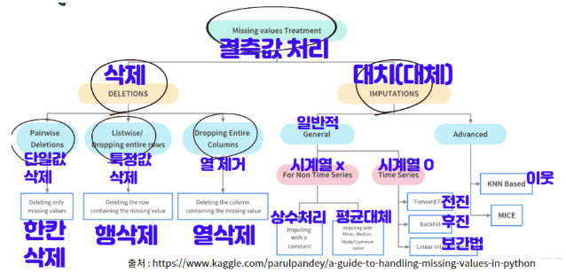
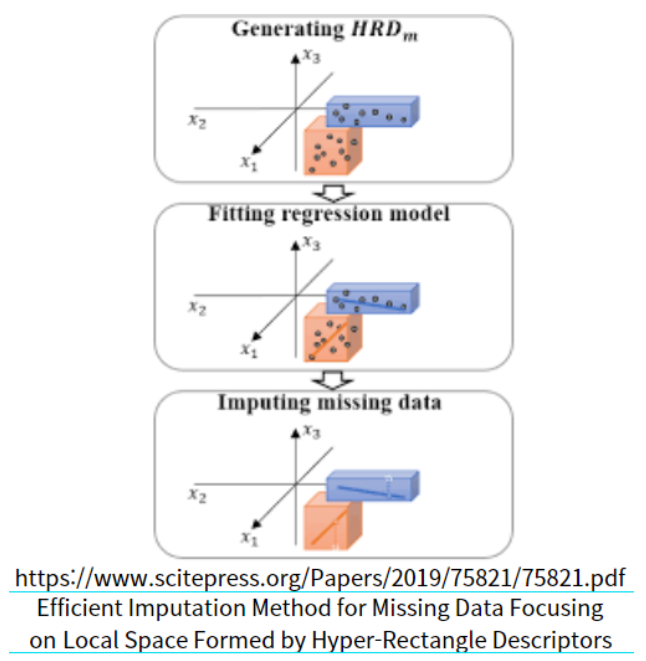
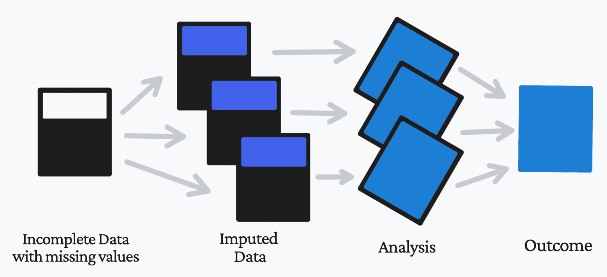

# 결측치 처리 방법
> 작성자: [황은비](https://github.com/eunv0110)   
> 키워드: 결측치/결측 데이터, 데이터 전처리

*출처: [charstring.tistory](https://charstring.tistory.com/1032) 

### 1. 삭제 방법
**완전 사례 분석 (Complete Case Analysis)**
- 결측치가 하나라도 있으면 해당 데이터를 삭제하는 방법

**삭제 유형**
- 단일 삭제: 결측치가 있는 관측값만 제거
- 행 삭제: 결측치가 있는 행 전체 제거
- 열 삭제: 결측치가 있는 열 전체 제거

**✅ 장점**

- 구현이 간단함
- 편향되지 않는 추정치를 얻을 수 있음

**❌ 단점**
- 데이터 손실이 큼
- 표본 크기가 줄어들어 통계적 검정력 감소

### 2. 단일 대체
- 결측값을 하나의 값으로 대체하는 방법

**대체값 유형**
- 최빈값 (Mode)
- 평균값 (Mean)
- 중앙값 (Median)

**❌ 단점**
- 편향된 추정치가 발생할 수 있음

### 3. 연역 대체
- 외부 자료 혹은 다른 변수들을 기반으로 논리적인 값을 도출하여 결측값을 추정하는 방법

**✅ 장점**
- 논리적인 값 도출 가능

**❌ 단점**
- 모든 경우에 적용하기 어려움

### 4. 핫덱 대체 (Hot-deck Imputation)
- 동일하거나 유사한 특성을 가진 응답값 중에서 랜덤으로 추출하여 결측값을 대체하는 방법

**✅ 장점**
- 분포의 특성을 어느 정도 보전할 수 있음

### 5. 일치대응대체법
- 동일한 조사단위를 외부 자료에서 식별하여 결측치를 대체하는 방법

**❌ 단점**
- 외부 자료를 찾는 것이 쉽지 않음

### 6. 회귀 대체

*출처: [charstring.tistory](https://charstring.tistory.com/1032) 
- 회귀분석 모델을 사용하여 결측값을 대체하는 방법

**구성 요소**
- 종속 변수: 결측치가 있는 변수
- 독립 변수: 결측치가 있는 변수를 제외한 모든 변수

**✅ 장점**
- 합리적인 대체값 제공
**❌ 단점**
- 예측 오차를 고려하지 않아 분산을 과소 추정할 수 있음

### 7. 다중 대체 (Multiple Imputation)

*출처: [kdnuggets](https://www.kdnuggets.com/2022/12/3-approaches-data-imputation.html)

**프로세스**
- m개의 서로 다른 대체값 데이터셋 생성
- 각 대체된 데이터셋에서 모수 추정
- m개의 추정치와 표준오차를 결합하여 최종 추정치 도출

**✅ 장점**
- 결측치로 인한 불확실성을 적절히 반영

**❌ 단점**
- 계산 시간이 많이 소요됨

### 8. 시계열에서의 결측치
**처리 방법**
- 보간법 (Interpolation): 시간의 흐름을 기반으로 데이터를 계산해서 결측치 채움
- 후진법 (Backward Fill): 뒷값으로 결측치 채움
- 전진법 (Forward Fill): 이전값으로 결측치 채움

### 9. 범주값의 결측치
- 특정 카테고리로 데이터를 대체하는 방법

### 10. 머신러닝 모델에서의 결측치 취급
**Decision Tree (의사결정나무)**
- 트리 분할 시 결측치를 별도의 변수로 취급
- 결측치가 있는 경우를 별도의 브랜치로 설정하여 학습

**XGBoost**

- Loss가 최소화되는 방향으로 결측치를 처리
- missing 파라미터를 기반으로 결측치 처리

**LightGBM**

- 결측값을 자동으로 인식하여 최적화된 처리
- Loss가 최소화되는 방향으로 결측치를 보내는 split을 탐색
