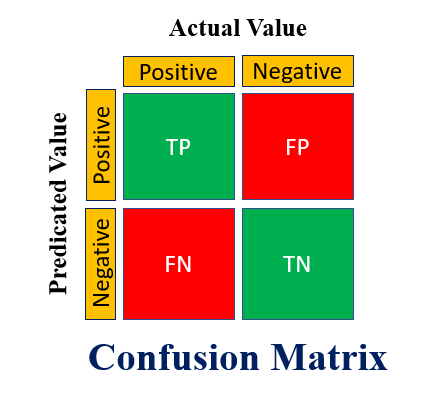
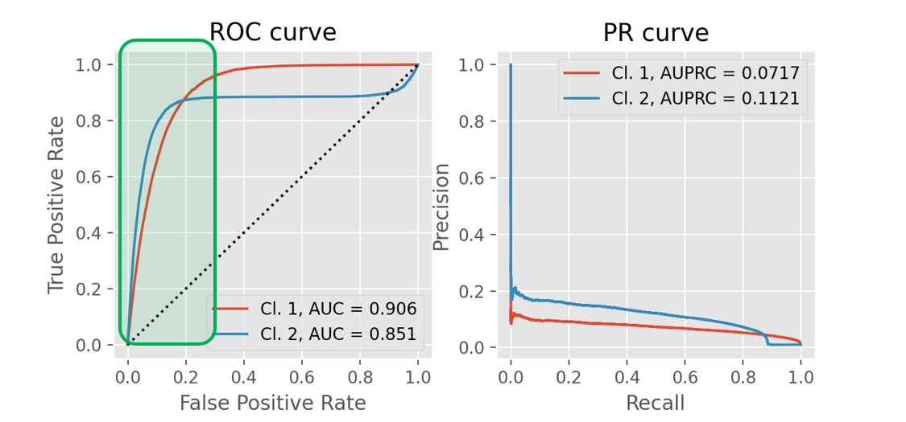

# 분류모델 평가지표
> 작성자: [황은비](https://github.com/eunv0110)   
> 키워드: Confusion matrix, Accuracy, Precision, Recall, F1-score, F-Beta Score, AUROC, AUPRC

### **Confusion Matrix**

*출처: [techplayon](https://www.techplayon.com/understanding-confusion-matrix-in-machine-learning/)   
- 모델이 얼마나 헷갈려하는지 보여주는 지표
- 주로 이진 분류에서 많이 사용하는 것을 볼 수 있다
- TP : 긍정인데 긍정으로 예측한거
- TN : 부정인데 부정으로 예측한거
- FP : 부정인데 긍정으로 예측한거
- FN : 긍정인데 부정으로 예측한거

### **Accuracy (정확도)**
- 얼마나 모델이 정답을 잘 맞췄는가~
- $\text{Accuracy} = \frac{TP + TN}{TP + TN + FP + FN}$

> **TP**: True Positive (참 양성)  
> **TN**: True Negative (참 음성)  
> **FP**: False Positive (거짓 양성)  
> **FN**: False Negative (거짓 음성)

- 전체 고객 중 맞게 예측한 비율이지만, 대부분 고객이 물건을 안 산다면 '안 살 것이다'라고 예측만 해도 정확도는 높게 나올 수 있어 불균형 데이터에서는 큰 의미가 없을 수 있음

### **Precision (정밀도)**
- 긍정으로 예측된것 중에 진짜 긍정인 비율
- $\text{Precision} = \frac{TP}{TP + FP}$

> **TP**: True Positive (참 양성)  
> **FP**: False Positive (거짓 양성)

- 마케팅 예시: 광고를 보낸 고객 중 실제로 구매한 비율. Precision이 높다는 것은 '광고를 보내면 살 확률이 높은 사람'만 잘 골랐다는 의미로, 불필요한 광고를 줄여 광고 예산을 절약할 수 있음

### **Recall (재현율)**
- 긍정인것 중에 진짜 긍정으로 예측된 비율
- $\text{Recall} = \frac{TP}{TP + FN}$

> **TP**: True Positive (참 양성)  
> **FN**: False Negative (거짓 음성)

- 마케팅 예시: 실제로 구매할 고객 중 광고를 받은 비율. Recall이 낮으면 살 사람이었는데 광고를 안 받는 경우가 생겨 기회 손실로 이어질 수 있음. 매출 확대가 목표라면 재현율을 높이는 게 중요

### **F1-Score**
- Recall과 Precision의 균형을 이루는 걸 나타내는 방법
- Recall과 Precision의 경우 하나가 높아지면, 하나가 내려가는 트레이드오프의 관계가 있어 둘 다 높도록 조절하는 것이 중요
- $\text{F1-Score} = 2 \times \frac{\text{Precision} \times \text{Recall}}{\text{Precision} + \text{Recall}}$

> **Precision**: 정밀도  
> **Recall**: 재현율

### **F-Beta Score**
- Precision과 Recall의 중요도를 다르게 하여 조화평균을 일반화하는 지표
- $F_\beta = (1 + \beta^2) \times \frac{\text{Precision} \times \text{Recall}}{(\beta^2 \times \text{Precision}) + \text{Recall}}$

> **β (베타)**: Recall의 중요도를 조절하는 하이퍼파라미터  
> **Precision**: 정밀도  
> **Recall**: 재현율

- β (베타): Recall의 중요도를 조절하는 하이퍼파라미터
  - β > 1: **Recall을 더 중요시**
  - β < 1: **Precision을 더 중요시**
  - β = 1: F1 Score (Precision과 Recall 동일 비중)

### **AUROC**

*출처: [glassboxmedicine](https://glassboxmedicine.com/2019/02/23/measuring-performance-auc-auroc/)   
- FPR이 변할때 TPR이 어떻게 변하는지 나타내는 곡선
- $\text{FPR} = \frac{FP}{FP + TN}$
- $\text{TPR} = \frac{TP}{TP + FN}$

> **FPR**: False Positive Rate (위양성률)  
> **TPR**: True Positive Rate (참양성률, 재현율과 동일)  
> **FP**: False Positive (거짓 양성)  
> **TN**: True Negative (참 음성)  
> **TP**: True Positive (참 양성)  
> **FN**: False Negative (거짓 음성)

- FPR을 분류 결정 임계값을 변경함으로써 조정할 수 있음 (FPR이 0이 되려면 임계값을 1로, FPR이 1이 되려면 임계값을 0으로)
- AUC는 ROC의 넓이를 뜻하며, AUC가 높을수록, 왼쪽위로 휘어질수록 좋은 성능. TPR이 높고 FPR이 낮을수록 예측 오류는 낮아지기 때문

### **AUPRC**

*출처: [Medium 블로그-Demystifying ROC and precision-recall curves](https://medium.com/data-science/demystifying-roc-and-precision-recall-curves-d30f3fad2cbf)     

- 정밀도-재현율 곡선 아래 면적
- $\text{AUPRC} = \int_0^1 \text{Precision}(\text{Recall}) \, d(\text{Recall})$

> **AUPRC**: Area Under the Precision-Recall Curve  
> **Precision**: 정밀도  
> **Recall**: 재현율

- Precision과 Recall의 관계를 그래프(곡선)로 나타낸 것으로, AUPRC가 이 그래프의 아래 면적
- 1에 가까울수록 좋은 값 (0~1사이의 값)
- 특히 데이터 불균형에서 AUROC보다 더 적합. Positive 비율이 매우 적을 때 유용하며, AUPRC는 Positive 예측 성능에 더 민감하게 반응
- 데이터가 균형이면 ROC AUC, 데이터가 불균형이면 AUPRC를 사용하는 것이 적합