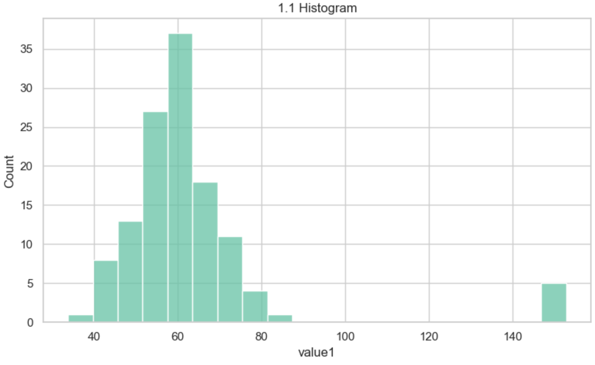
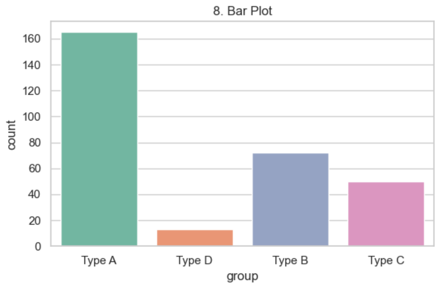
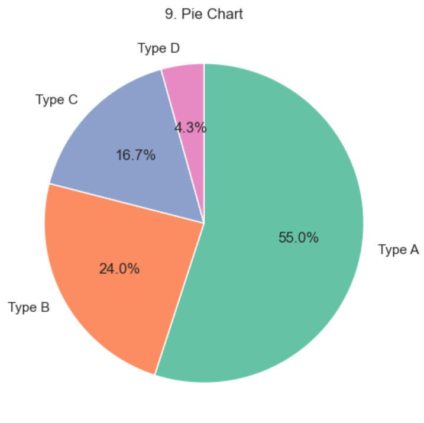
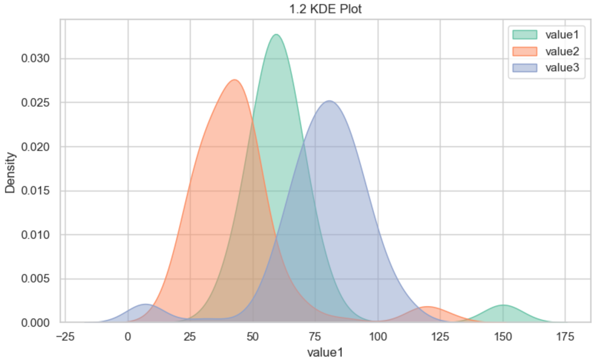
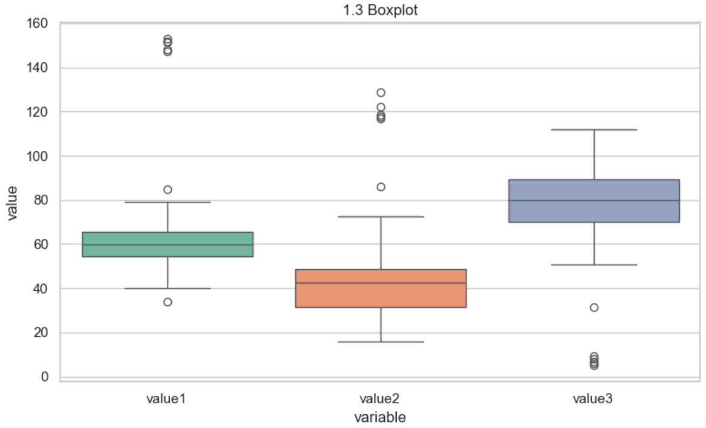
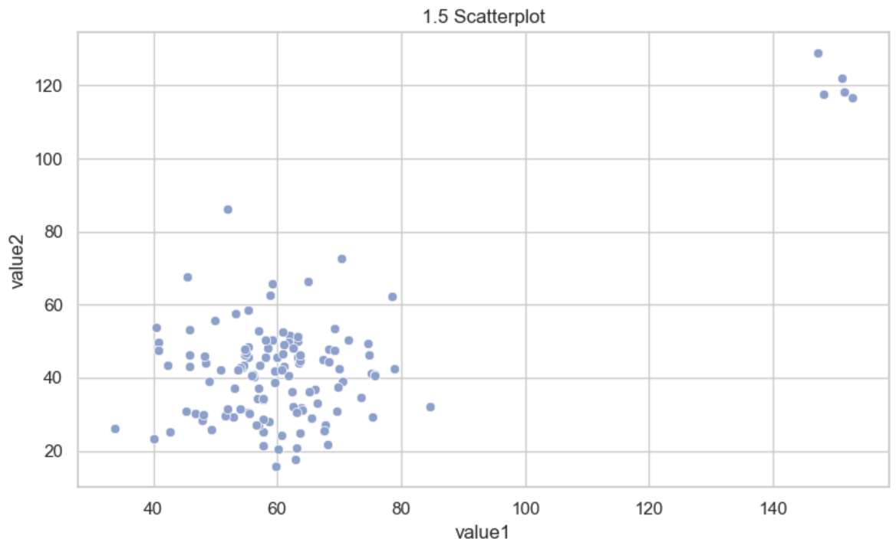
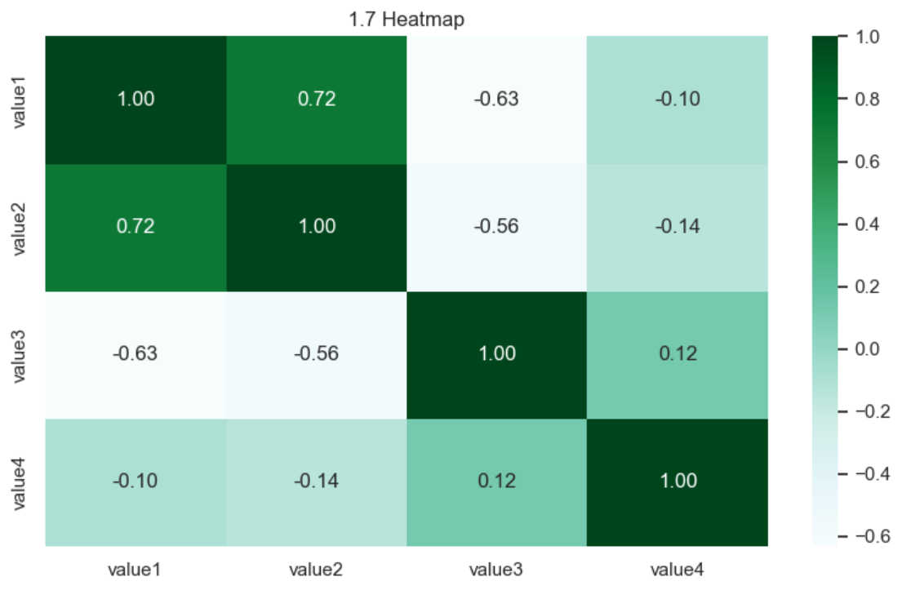

# EDA 그래프 종류
> 작성자: [이다인](https://github.com/daainn)   
> 키워드: EDA, 데이터 시각화, matplotlib, seaborn

<br>

### 그래프 종류 설명

- [1. 히스토그램 (Histogram)](#1-히스토그램-histogram)
- [2. 막대그래프 (Countplot)](#2-막대그래프-countplot)
- [3. 파이차트 (Pie Chart)](#3-파이차트-pie-chart)
- [4. KDE 플롯 (KDE Plot)](#4-kde-플롯-kde-plot)
- [5. 박스플롯 (Boxplot)](#5-박스플롯-boxplot)
- [6. 바이올린 플롯 (Violinplot)](#6-바이올린-플롯-violinplot)
- [7. 산점도 (Scatterplot)](#7-산점도-scatterplot)
- [8. 페어플롯 (Pairplot)](#8-페어플롯-pairplot)
- [9. 히트맵 (Heatmap)](#9-히트맵-heatmap)

### Interview Question

- [히스토그램과 KDE Plot의 차이점은 무엇이며, 각각 어떤 상황에서 더 적합한가요?](#q1)
- [박스플롯과 바이올린플롯의 장단점을 비교하고, 어떤 데이터를 분석할 때 바이올린플롯이 더 유용한가요?](#q2)
- [히트맵에서 상관계수 기반 시각화의 한계는 무엇인가요?](#q3)
- [페어플롯(Pairplot)이 탐색적 분석에서 유용하지만 한계점도 있는 이유는?](#q4)

<br>

---

## 1. 히스토그램 (Histogram)
> **수치형 변수 그래프**
- 연속형 수치 데이터의 빈도 분포를 막대 형태로 표현하며 구간을 나누어 데이터가 얼마나 자주 등장하는지 확인 가능
- (+) 데이터의 중심 경향과 분포 형태를 빠르게 파악할 수 있어 전체적인 구조 이해에 유리함
- (-) 구간(bin)의 개수 설정에 따라 시각적 해석이 달라질 수 있어 주의가 필요함

```python
sns.histplot(data=df, x="수치형변수", bins=30)
```



<br>


## 2. 막대그래프 (Countplot)
> **범주형 변수 그래프**
- 범주형 변수의 빈도를 막대그래프로 표현
- (+) 각 범주의 데이터 분포를 직관적으로 비교할 수 있어 개요 파악에 효과적임
- (-) 범주의 수가 많을 경우 해석이 어려워질 수 있음

```python
sns.countplot(data=df, x="범주형변수")
```



<br>

## 3. 파이차트 (Pie Chart)
> **범주형 변수 그래프**
- 범주형 변수의 비율을 원형 형태로 표현
- (+) 전체 구성비를 직관적으로 나타내기 적합하여 간단한 비율 비교에 유리함
- (-) 작은 비율은 시각적으로 구분이 어려움

```python
df["범주형변수"].value_counts().plot.pie(autopct="%1.1f%%")
```



<br>


## 4. KDE 플롯 (KDE Plot)
- 커널 밀도 추정 방식으로 확률 밀도 함수를 시각화
- 히스토그램보다 부드러운 분포 형태 확인 가능
- (+) 부드러운 곡선으로 분포의 세부 구조를 파악할 수 있어 그룹 간 비교에 적합함
- (-) 이상치나 이산형 데이터에 민감하게 반응하여 왜곡된 결과를 보일 수 있음

```python
sns.kdeplot(data=df, x="범주형변수", fill=True)
```



<br>

## 5. 박스플롯 (Boxplot)
- 사분위수를 기준으로 데이터 분포 요약 및 이상치 시각화
- 중앙값, IQR, whisker, 이상치 등을 한눈에 보여줌
- (+) 데이터의 범위, 분산, 이상치를 명확하게 파악할 수 있어 비교 분석에 효과적임
- (-) 분포의 전체 모양을 나타내지 않아 비대칭성이나 정확한 분포 파악이 어려움

```python
sns.boxplot(data=df, x="범주형변수", y="수치형변수")
```




<br>

## 6. 바이올린 플롯 (Violinplot)
- 박스플롯 + KDE 결합형 그래프
- 분포 밀도와 사분위값을 동시에 보여줌
- (+) 박스플롯보다 더 풍부한 분포 정보를 제공하여 데이터의 비대칭성과 특이점 파악이 용이함
- (-) 시각적으로 복잡하여 해석이 직관적이지 않을 수 있음

```python
sns.violinplot(data=df, x="범주형변수", y="수치형변수")
```


<br>

## 7. 산점도 (Scatterplot)
> **수치형 변수 그래프**
- 두 수치형 변수 간의 관계를 점으로 시각화
- 상관관계, 패턴, 클러스터 여부 등을 시각적으로 확인 가능
- (+) 변수 간 상관관계나 이상값 탐지에 효과적이며 직관적인 시각화가 가능함
- (-) 데이터가 많을 경우 점들이 겹쳐져 해석이 어려울 수 있음

```python
sns.scatterplot(data=df, x="수치형변수", y="수치형변수")
```




<br>

## 8. 페어플롯 (Pairplot)
- 여러 수치형 변수 간 모든 조합의 산점도 + 히스토그램 시각화
- (+) 변수 간 관계, 분포, 클러스터를 한눈에 볼 수 있어 탐색적 데이터 분석에 적합함
- (-) 변수 수가 많을 경우 시각적으로 복잡해지고 해석이 어려움

```python
sns.pairplot(df)
```


<br>

## 9. 히트맵 (Heatmap)
- 수치형 변수 간의 상관계수 행렬을 색상으로 시각화
- (+) 변수 간의 선형 관계 강도와 방향을 직관적으로 파악할 수 있어 피처 선택에 유용함
- (-) 비선형 관계를 포착하지 못하며, 변수 간 의미 없는 상관관계도 강조될 수 있음

```python
corr = df.corr(numeric_only=True)
sns.heatmap(corr, annot=True, fmt=".2f")
```



<br>

---

### Interview Question


<h3 id="q1"></h3>
<details>
<summary><strong>히스토그램과 KDE Plot의 차이점은 무엇이며, 각각 어떤 상황에서 더 적합한가요?</strong></summary>

- 히스토그램은 구간(bin)을 기준으로 빈도를 막대 형태로 표현하는 반면, KDE Plot은 부드러운 곡선으로 분포를 나타냄  
- 히스토그램은 직관적이고 이상치에 강하지만, KDE는 분포의 형태(비대칭, 다봉 등)를 더 정밀하게 파악할 수 있음  
- 예: 단순 분포 파악 → 히스토그램 / 정규성 검정 또는 분포 비교 → KDE Plot

</details>


<h3 id="q2"></h3>
<details>
<summary><strong>박스플롯과 바이올린플롯의 장단점을 비교하고, 어떤 데이터를 분석할 때 바이올린플롯이 더 유용한가요?</strong></summary>

- 박스플롯은 사분위수 중심으로 요약값과 이상치를 보여주며 해석이 간단함  
- 바이올린플롯은 KDE 기반으로 분포 밀도까지 보여주므로 비대칭 분포나 다봉 분포 파악에 유리함  
- 이상치 존재 여부 파악 → 박스플롯 / 분포의 형태까지 파악 → 바이올린플롯

</details>

<h3 id="q3"></h3>
<details>
<summary><strong>히트맵에서 상관계수 기반 시각화의 한계는 무엇인가요?</strong></summary>

- 히트맵은 변수 간 선형 관계만 포착 가능하며, 비선형 관계는 간과됨  
- 상관관계가 높더라도 인과관계는 보장되지 않음 → 해석에 주의 필요  
- 데이터의 규모가 크거나, 의미 없는 상관이 강조될 경우 과잉 해석 우려가 있음

</details>

<h3 id="q4"></h3>
<details>
<summary><strong>페어플롯(Pairplot)이 탐색적 분석에서 유용하지만 한계점도 있는 이유는?</strong></summary>

- 수치형 변수 간의 관계를 전체적으로 시각화할 수 있어 개요 파악에 유리함  
- 변수 수가 많을수록 시각적으로 복잡해지고 해석이 어려워짐  
- 데이터가 너무 많으면 겹쳐진 점들로 인해 유의미한 패턴을 놓칠 수 있음

</details>