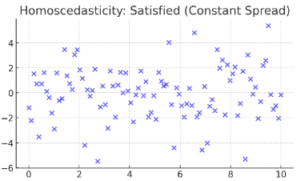

# 선형 회귀

### 선형 회귀란 ?

- **목적**: X(원인 변수)와 Y(결과 변수)의 관계를 직선으로 표현해 Y를 예측
- **모델 형태**:  
  $$ Y = \beta_0 + \beta_1X_1 + \beta_2X_2 + ... + \beta_nX_n + \epsilon $$

    - \( \beta_0 \): 절편(intercept)  
    - \( \beta_i \): 각 독립 변수의 계수(coefficient, 기울기)  
    - \( \epsilon \): 오차항(모델이 설명하지 못한 부분)

### **1. 선형회귀에서 기본 가정이 필요한 이유**

선형회귀는 데이터를 보고 **“이 값들은 직선(또는 평면)으로 설명할 수 있다”**는 가정 아래에서 수식을 세움

⇒ 그래서 가정이 틀릴 경우, **모델이 아무리 계산을 잘해도 결과가 엉터리**가 될 수 있음.

- **선형성**이 깨지면?  
  곡선으로 움직이는 데이터를 직선으로 억지로 그어버리니 **예측이 틀어짐**.
- **독립성**이 깨지면?  
  오차가 서로 연결돼 있어서, **p-value 같은 신뢰도 지표가 믿을 수 없게 됨**.
- **등분산성**이 깨지면?  
  작은 값은 예측 잘 맞고 큰 값은 엉망 → **회귀계수 신뢰구간이 왜곡됨**.
- **정규성**이 깨지면?  
  오차가 한쪽으로 몰려 있거나 꼬리가 길면, **t-검정, F-검정 결과가 틀려짐**.

따라서, 기본 가정을 만족해야 통계적 결론을 온전히 믿을 수 있음.

---

### 2. 4가지 기본 가정

### **① 선형성 (Linearity)**

  
선형성 만족

  
선형성 불만족

- **정의**: 독립변수(X)와 종속변수(Y)의 관계가 **직선으로 표현 가능**해야 함.
    - ex) 공부 시간이 늘어날수록 점수가 일정하게 오른다.
- **확인 방법:**  
    잔차(Residual) vs 예측값 그래프 → 잔차가 **무작위로 퍼져 있으면 OK**.
    - **잔차**: 관측값 y와 예측값 y의 차이 (오차)
- **선형성 불만족 시 대처:**  
    - 로그 변환, 제곱근 변환 등 변수 변환  
    - 다항 회귀(Polynomial Regression)로 비선형성 흡수  
    - 트리 모델, 랜덤 포레스트 등 비선형 모델 사용

---

### **② 독립성 (Independence)**

  
독립성 만족

  
독립성 불만족 (시간에 따른 잔차 패턴 반복)

- **정의**: 잔차들이 서로 연관되지 않고 독립이어야 함.
- **중요성**: 잔차들이 이어져 있으면 p-value, 표준오차 계산이 왜곡됨.
- **확인 방법:**  
    - **Durbin-Watson 통계량** (2에 가까우면 OK, 0이나 4 근처면 문제)  
    - 잔차 시계열 그래프에서 패턴 여부 확인
- **대처 방법:**  
    - 시계열 모델(AR, ARIMA) 적용  
    - 잔차 패턴을 새로운 변수로 추가

---

### **③ 등분산성 (Homoscedasticity)**

  
등분산성 만족

  
등분산성 불만족 (깔때기 모양)

- **정의**: 예측값의 크기와 상관없이 **잔차 분산이 일정**해야 함.
- **중요성**: 잔차 분산이 달라지면, **계수의 신뢰구간과 유의성 검정**이 왜곡됨.
- **확인 방법:**  
    - 잔차 vs 예측값 그래프 → 일정한 퍼짐이면 OK, 깔때기 모양이면 위반
- **대처 방법:**  
    - 로그 변환으로 분산 안정화  
    - 가중 최소제곱법(Weighted Least Squares) 사용

---

### **④ 정규성 (Normality)**

  
정규성 만족

  
정규성 불만족 (왜도/꼬리 발생)

- **정의**: 잔차들이 정규분포(종 모양)을 따라야 함.
- **중요성**: 정규성이 깨지면 t/F 검정 해석이 왜곡됨.
- **확인 방법:**  
    - Q-Q Plot (대각선 근처면 OK)  
    - Shapiro-Wilk, Kolmogorov-Smirnov 테스트
- **대처 방법:**  
    - 로그 변환, Box-Cox 변환으로 정규성 보정  
    - 이상치 제거 또는 Winsorization 처리

---

## **3. 가정별 확인 그래프 요약**

- **선형성**: Residual vs Predicted → 곡선 패턴 없으면 OK  
- **독립성**: Residual 시계열 Plot, Durbin-Watson ≈ 2  
- **등분산성**: Residual vs Predicted → 깔때기 모양 없으면 OK  
- **정규성**: Q-Q Plot, 히스토그램 → 종 모양이면 OK

---

### 4. 선형회귀 결과 해석 방법

모델이 가정을 만족한다고 가정할 때 결과 해석은 3단계:

1. **모형의 설명력 (R² 확인)**  
    - 모델이 데이터를 얼마나 잘 설명하는지 확인.  
    - 예: R²=0.8이면, 종속변수 변동의 80%를 독립변수가 설명.  
    - 1에 가까울수록 좋지만, 너무 높으면 과적합 의심.

2. **모형 전체의 통계적 유의성 (F-검정)**  
    - 독립변수들이 모여서 종속변수를 설명할 힘이 있는지 확인.  
    - p-value < 0.05이면 유의미한 모델로 간주.

3. **개별 독립변수의 유의성 (t-검정)**  
    - 각 독립변수가 종속변수에 미치는 영향 확인.  
    - p-value < 0.05인 변수만 중요한 변수로 해석.  
    - 계수가 +면 Y 증가, -면 Y 감소에 기여.

---

### **면접 응용 질문과 답변**

- **가정 위반 시 결과 해석이 왜 틀어지는지?**  
  회귀계수와 신뢰구간이 왜곡되고 p-value 해석이 잘못되어 모델 해석이 부정확해짐.

- **각 검정법이 어떤 가정을 확인하는지?**  
  - Durbin-Watson: 독립성 (오차 자기상관)  
  - Q-Q Plot, Shapiro-Wilk: 정규성  
  - Residual vs Predicted Plot: 선형성, 등분산성  
  - F-test: 전체 모델 유의성  
  - t-test: 개별 변수 유의성